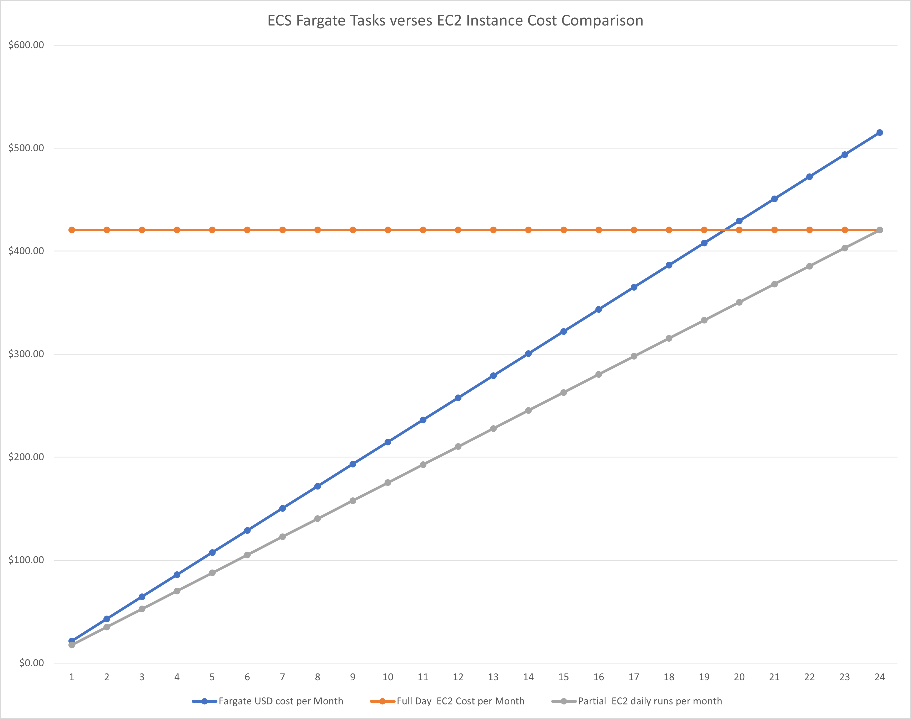

# Terraform example of AWS Fargate Jenkins platform

The goal is to create a container of the Jenkins master and linux agent in the AWS Fargate platform using Terraform. The Docker Images are created from scratch and are instantiated as AWS Fargate tasks. The linux agent tasks will run for the job's duration and are started/destroyed by the Amazon Elastic Container Service (ECS)/Fargate Jenkins Plugin. Both the Jenkins's service and agent persistent state are managed by AWS EFS services.

The project is divided into four phases and each phase has to be completed in order.

[Phase 1: Configure the Base Infrastructure](https://github.com/rroehl/AWS_ECSJenkinsImplementation/tree/main/Phase_1_ECSFargateJenkins/) - The fundamental infrastructure is created.

[Phase 2: Configure the Application Infrastructure](https://github.com/rroehl/AWS_ECSJenkinsImplementation/tree/main/Phase_2_ECSJenkinsInfrastructure/) - The application specific infrastructure is configured.

[Phase 3: Create the Jenkins Service and Agent Container Images](https://github.com/rroehl/AWS_ECSJenkinsImplementation/tree/main/Phase_3_ECSDockerJenkinsContainer/) - The Jenkins service and agent Docker images are created and uploaded into AWS ECR.

[Phase 4: Create the Jenkins Service ECS Tasks on Fargate](https://github.com/rroehl/AWS_ECSJenkinsImplementation/tree/main/Phase_4_ECSCreateJenkinsContainer/) - The Terraform scripts will start the Jenkins Service as an ECS Task.

### Last Steps

Once all the phases are completed, the Jenkins can be access via the AWS Load Balancer DNS address over HTTP. The Jenkins ECS plugin is configured based on the parameters passed to it via Terraform. To test it, create a job called Test and select label for "Restrict where this project can be run" as the "Linux_Agent". It will state its not created which is correct. For the Build steps used "Execute Shell" and you can use these steps:
echo "Hello World"
date >> date.txt
cat date.txt

Next, run the job. It will instantiate the ECS task on Fargate and when the Jenkins agent finishes the task is terminated. The state is for the Agent is saved on the EFS volume.

### Cost Analysis

The goal of the ECS Fargate tasks verses EC2 Instance cost comparison is to investigate the costs of ECS Fargate tasks verses EC2 instances.  The Y axis is the monthly cost and the x axis is the hours per day that the tasks or instances will run.

For the ECS tasks, the cost includes three tasks and three EC2 instances. Each ECS task has four virtual cores, sixteen GB of RAM and forty GB of ephemeral disk space. Each EC2 instance is a m5.xlarge with four virtual cores, sixteen GB of RAM, and  on demand pricing. The calculations did not include such items as AWS EFS or EBS volumes. The calculations are to give approximate cost analysis and the calculations can be found at the bottom. The pricing data is of February 15, 2023 and the calculations are based on AWS cost calculator.

The red line is the monthly cost to run three m5.xlarge EC2 instances 24 by 7 for the whole month. The blue line is the cost to run three tasks X number of hours for a month. The gray line is cost to run three m5.xlarge EC2 instances X number of hours per day for a month.

From a cost perspective, tasks running on Fargate should be short lived which is how micro services run. For Jenkins agents, short lived runs make cost sense; however,long running tasks on Fargate should be evaluated carefully. The pricing is based on demand and Fargate does supports Spot pricing.

Besides costs, there are other advantages to containers in AWS. ECS tasks can run on EC2 instances and containers can execute on AWS EKS, and both of these options remove the Fargate costs.

### Calculations

ECS Fargate Monthly Cost Calculations:
number_of_tasks_per_day * 730 / 24 = {tasks per month}
{tasks per month} x cpu_per_task x hours_per_day_task_period x 0.04048 = {USD for CPU}
{tasks per month}  x GB_RAM_per_task x hours_per_day_task_period x 0.004445 = {USD for RAM}
{tasks per month}  x (ephemeral_GB_storage_per_task - 20) x hours_per_day_task_period x 0.000111 = {USD for ephemeral storage}
ECS Fargate:  {USD for CPU} + {USD for RAM} + {USD for ephemeral storage} = {Total USD costs}

EC2 Full  m5.xlarge cost
Monthly charge for on demand EC2 instance
3 instances x 0.192 USD On Demand hourly cost x 730 hours in a month = 420.48 USD

EC2 Partial Daily m5.xlarge cost
3 instances x  hours_per_day_instance runs x 0.192 USD On Demand hourly cost x 730 hours in a month / 24 hours per day = monthly costs